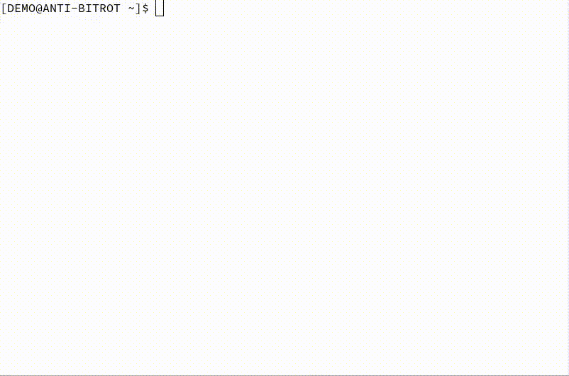

# Linux

This is a publicly-accessible backup of various **personal notes** about options to detect and prevent [bitrot](https://en.wikipedia.org/wiki/Data_degradation) and other unintentional file changes. Requires GNU/Linux with bash shell, or a sufficiently similar platform, and experience with `bash`, `findutils`, `grep`, and `coreutils`.

These notes don't expect a malicious actor. The goal is the prevention of **accidental** corruption of archival-grade important data, such as photos. Don't ever use MD5 for anything even remotely security-related, because it is cryptographically [broken](https://en.wikipedia.org/wiki/MD5#Security). I just use it because it's very fast.

This directory (except for `old`) contains things I use right now (at the time of writing this, 2022). If you're browsing through for inspiration, I recommend ignoring `old`. The directory `old` contains notes and scripts from years 2018-2020. I don't use them anymore, but keep them for future reference.

* `par2/` directory contains scripts for protecting files with error-checking and error-correcting codes.
* `md5sum.md` contains snippets for protecting files with error-checking codes.
* `sha256.md` contains snippets for protecting files with error-checking codes and generating a cryptographically secure HMAC using a locally-stored secret to detect tampering in low-risk environments.

For important-enough data, I create all of them, usually in this order: md5, par2, sha256.hmac. The benefit is that there's overlap when recreating either of them, in case a corruption happens in the time between deleting the old version of an error-detection file and creating a new version of the error-detection file. Each of them can be used with a different granularity.

Screencap demo of error check and repair using md5sum and par2cmdline (webm format):

https://user-images.githubusercontent.com/11985285/202166222-56505607-7f3d-49bc-9a9a-36e678779910.mov

Screencap demo of error check and repair using md5sum and par2cmdline (gif version with linked webm):

# Windows or Linux GUI

On Windows (or if you want to only use GUI on GNU/Linux), the easiest open-source option is to use [Double Commander](https://github.com/doublecmd/doublecmd) to generate and check MD5 or SHA2_256 files. It works recursively on directories, too. [Here's a how-to with screenshots](https://www.trishtech.com/2021/10/how-to-calculate-file-checksums-with-doublecommander/).
